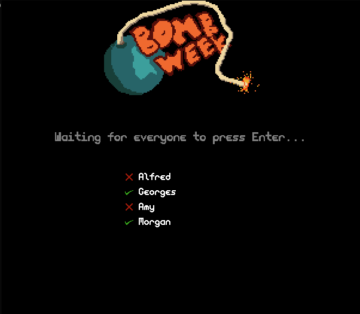
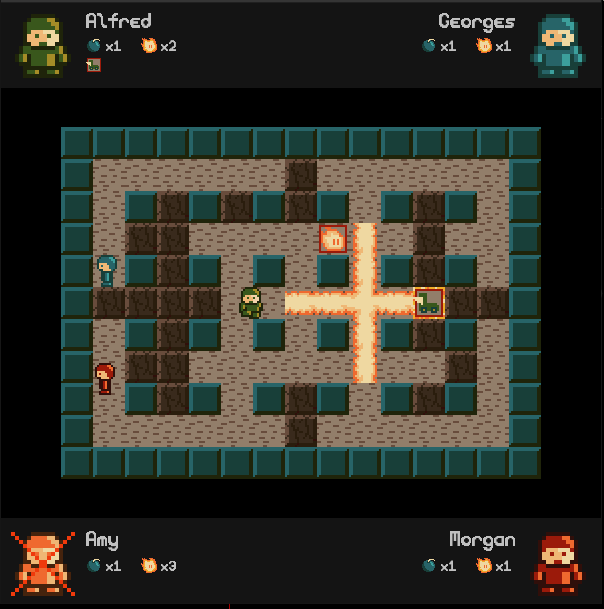
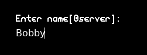
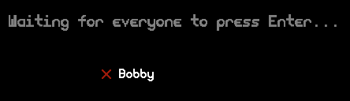
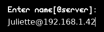
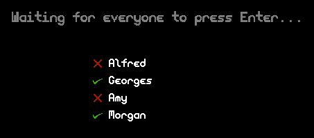

# Bomberman week
1 week game challenge, write a bomberman from scratch in python.

## Description

Multiplayer (network) classic bomberman game.

Very short on time, couldn't add sound, couldn't optimize rendering, couldn't optimize network communication.





## Usage

Install dependencies:
```
pip install -r requirements.txt
```

Run the client
```
python client.py
```

## Host a game

When you run the client, you'll be prompted for your name. Simply enter your name and you'll host a game :



You'll then be in the lobby, just wait for new players to join :




## Join a game

If a friend is hosting a game and his ip is `192.168.1.42`, run the client, and when prompted for your name :



You'll then be in the lobby.

## Start the game

When everyone is in the lobby, press <Enter> to tell everyone you're ready. The game will start when everyone is ready.


